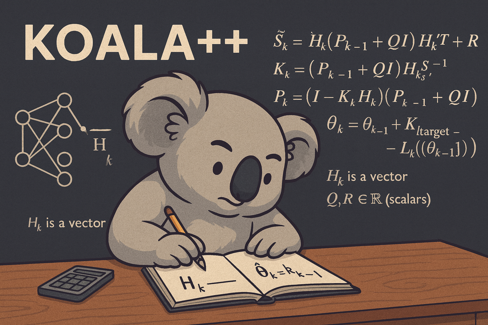
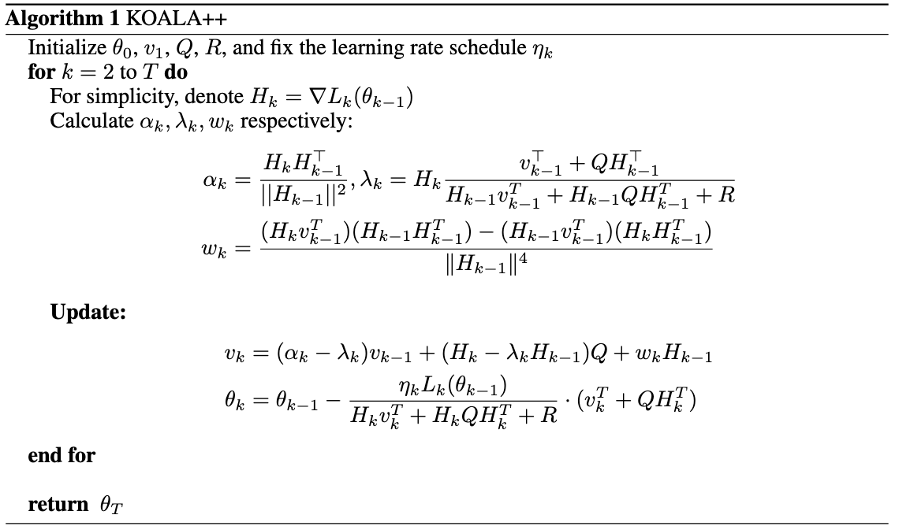

# KOALA++: Efficient Kalman-Based Optimization of Neural Networks with Gradient-Covariance Products

Abstract, _We propose KOALA++, a scalable Kalman-based optimization algorithm that explicitly models structured gradient uncertainty in neural network training. Unlike second-order methods, which rely on expensive second order gradient calculation, our method directly estimates the parameter covariance matrix by recursively updating compact gradient covariance products. This design improves upon the original KOALA framework that assumed diagonal covariance by implicitly capturing richer uncertainty structure without storing the full covariance matrix and avoiding large matrix inversions. Across diverse tasks, including image classification and language modeling, KOALA++ achieves accuracy on par or better than state-of-the-art first- and second-order optimizers while maintaining the efficiency of first-order methods._ 

<center>
<a href="https://openreview.net/group?id=NeurIPS.cc/2025/Conference/Authors&referrer=%5BHomepage%5D(%2F)" target="_blank">
    
</a>
<a href="https://arxiv.org/abs/2506.04432" target="_blank">
    
<div>
    <a href="https://sumxiaa.github.io/" target="_blank">Zixuan Xia</a><sup>1</sup>,</span>
    <a href="https://araachie.github.io/" target="_blank">Aram Davtyan</a><sup>2</sup>, </span>
    <a href="https://www.cvg.unibe.ch/people/favaro" target="_blank">Paolo Favaro</a><sup>2</sup>,</span>
</div>
<div>
    <sup>1</sup>Work done during Master studies at the University of Bern&emsp;
    <sup>2</sup>Computer Vision Group, University of Bern&emsp;
</div>
</center>
<center>
    
</center>

⚠️ **Note**  
This image was generated by ChatGPT.  
It is included here only for aesthetic purposes in the project structure  
and does not have any functional relation to the project itself.


> Official implementation of **KOALA++**, a scalable Kalman-based optimization algorithm for neural network training.  
> 📢 The code will be released **after the acceptance of our paper**.

---
## 📰 Latest News
- **[2025-09]** 🎉 Our paper has been **accepted at NeurIPS 2025**!  
- 🔜 Code release is coming soon — stay tuned!

---
## 📁 Repository Contents

- [💡 Methodology and Key Insights](#methodology-and-key-insights)
- [🌟 Getting Started](#getting-started)
- [🖼 Task 1: Image Classification](#task-1-image-classification)
  - [🔗 Integrating KOALA++ as an Optimizer](#integrating-koal-as-an-optimizer)
  - [Notes](#notes)
- [🧠 Task 2: Language Modeling](#task-2-language-modeling)
- [📜 License](#license)
- [📖 Citation](#citation)
- [✉️ Contact](#️-contact)


---
## 💡 Methodology and Key Insights

**KOALA++** extends the Kalman filtering view of optimization by explicitly propagating structured gradient uncertainty. Its core innovation lies in tracking a **directional covariance surrogate**:  

$$
v_k \;:=\; H_k\, P_{k-1} \;\in\; \mathbb{R}^{1\times n},
$$

instead of the full covariance \(P_{k-1}\in\mathbb{R}^{n\times n}\).
Here **\(H_k\in\mathbb{R}^{1\times n}\)** and **\(v_k\in\mathbb{R}^{1\times n}\)** are row vectors，
and **\(Q, R \in \mathbb{R}\)** are scalers。
This surrogate captures anisotropic uncertainty while keeping memory and computational cost comparable to first-order optimizers.

---

### Why \(\alpha_k\) and \(w_k\) Appear
Expanding the recursion for \(v_k\) using the covariance update \(P_{k-1}=(I-K_{k-1}H_{k-1})(P_{k-2}+Q)\) gives
a term that cannot be computed directly without storing \(P_{k-2}\):

$$
v_k \;=\; H_k P_{k-1}
\;=\; H_k\,(I-K_{k-1}H_{k-1})\,(P_{k-2}+Q)
\;\;\Longrightarrow\;\; \text{appears } H_k P_{k-2}.
$$

To eliminate \(H_k P_{k-2}\), KOALA++ estimates \(P_{k-2}\) via a **least-squares** problem with the constraint
\(v_{k-1} = H_{k-1} P_{k-2}\).

---

### Least-Squares Objective
We seek a surrogate for \(P_{k-2}\) with minimum Frobenius norm:

$$
\begin{aligned}
\min_{P_{k-2}} \quad & \|P_{k-2}\|_F^2 \\
\text{s.t.}\quad & H_{k-1} P_{k-2} = v_{k-1}\, .
\end{aligned}
$$

This underdetermined system admits multiple solutions. KOALA++ considers **two variants**:

---

#### (i) Vanilla (Asymmetric) Solution
Unconstrained least-squares gives
$$
P_{k-2}
\;=\;
\frac{H_{k-1}^{\top}\, v_{k-1}}{\|H_{k-1}\|^2}\;\in\;\mathbb{R}^{n\times n}.
$$

Thus
$$
H_k P_{k-2}
\;=\;
\alpha_k\, v_{k-1},
\qquad
\alpha_k \;:=\; \frac{H_k\, H_{k-1}^{\top}}{\|H_{k-1}\|^2}\;\in\;\mathbb{R}.
$$

---

#### (ii) Symmetric Solution
Enforcing \(P_{k-2}=P_{k-2}^{\top}\) yields
$$
P_{k-2}
\;=\;
\frac{H_{k-1}^{\top} v_{k-1} + v_{k-1}^{\top} H_{k-1}}{\|H_{k-1}\|^2}
\;-\;
\frac{\,H_{k-1} v_{k-1}^{\top} H_{k-1}^{\top} H_{k-1}\,}{\|H_{k-1}\|^4}.
$$

Substituting into \(H_k P_{k-2}\) introduces an extra correction term \(w_k\):
$$
H_k P_{k-2}
\;=\;
\alpha_k\, v_{k-1} \;+\; w_k\, H_{k-1},
$$

where
$$
w_k
\;:=\;
\frac{(H_k v_{k-1}^{\top})(H_{k-1} H_{k-1}^{\top})
\;-\;
(H_{k-1} v_{k-1}^{\top})(H_k H_{k-1}^{\top})}{\|H_{k-1}\|^4}\;\in\;\mathbb{R}.
$$

---

### Unified Recursion and Parameter Update

Define the **innovation covariance** and **Kalman gain**：
$$
S_k \;=\; H_k v_k^{\top} \;+\; H_k Q H_k^{\top} \;+\; R,
\qquad
K_k \;=\; \frac{\,v_k^{\top} + Q H_k^{\top}\,}{S_k}\;\in\;\mathbb{R}^{n\times 1}.
$$

Define
$$
\lambda_k \;:=\; \frac{\,H_k\,(v_{k-1}^{\top} + Q H_{k-1}^{\top})\,}{\,S_{k-1}\,}\;\in\;\mathbb{R}.
$$

Then the unified **\(v_k\)** recursion is
$$
v_k
\;=\;
(\alpha_k - \lambda_k)\, v_{k-1}
\;+\;
(H_k - \lambda_k H_{k-1})\, Q
\;+\;
w_k\, H_{k-1},
$$
with \(w_k=0\) in the asymmetric (vanilla) case.

Finally, choosing \(L^{\text{target}}_k = (1-\eta_k)\,L_k(\theta_{k-1})\) gives the **parameter update**
$$
\theta_k
\;=\;
\theta_{k-1}
\;-\;
\eta_k\, L_k(\theta_{k-1})\;
\frac{\,v_k^{\top} + Q H_k^{\top}\,}{\,H_k v_k^{\top} + H_k Q H_k^{\top} + R\,}.
$$

---

### Algorithm Summary
<p align="center">
  
</p>

---
## 🌟 Getting Started

To get started, first clone the AdaFisher benchmark repository and set up the environment as described in their instructions:

```bash
git clone https://github.com/AtlasAnalyticsLab/AdaFisher.git
cd AdaFisher
# Follow their README to install the required dependencies

---
## 🖼 Task 1: Image Classification

Navigate to the `Task1_Image_Classification` directory. This task supports training on both CIFAR-10 and CIFAR-100 datasets.

### Run Training

- To train on **CIFAR-10**:

```bash
bash train_cifar10.sh
```

- To train on **CIFAR-100**:

```bash
bash train_cifar100.sh
```
### 🔗 Integrating KOALA++ as an Optimizer

KOALA++ differs from standard optimizers in that it performs a **two-step update**:  
- `predict()` before the forward/backward pass,  
- `update(loss_mean, loss_var)` after the backward pass.  

Here is an example integration into a PyTorch training loop:

```python

# Initialize KOALA++ optimizer
optimizer = KOALAPlusPlus(
            params=model.parameters(),
            sigma=sigma, q=q, r=None, alpha_r=0.9,
            weight_decay=0.0005, lr=lr

for i, (inputs, targets) in enumerate(train_loader):
    # Measure data loading time
    data_time.update(time.time() - end)

    inputs  = inputs.cuda(non_blocking=True)
    targets = targets.cuda(non_blocking=True)

    # --- KOALA++ prediction step ---
    optimizer.predict()

    # Forward + compute loss
    outputs   = model(inputs)
    loss      = criterion(outputs, targets)
    loss_mean = loss.mean()

    # Backward
    optimizer.zero_grad()
    loss_mean.backward()

    # --- KOALA++ update step ---
    loss_var = torch.mean(loss.pow(2))   # or variance depending on implementation
    optimizer.update(loss_mean, loss_var)
```


### Notes

- You can modify the optimizer, learning rate, and other hyperparameters directly within the respective `.sh` script files.
- All optimizers from AdaFisher (e.g., AdaFisher, SGD, Adam, etc.) are supported.

---
## 🧠 Task 2: Language Modeling

Navigate to the `Task2_Language_Model` directory.

### Run Training

Simply run the corresponding training script to begin training your language model:

```bash
bash train_language_model.sh
```

> The script will use the configuration set inside to launch the training procedure, and you can modify the script for different optimizers or hyperparameter settings.

---
## 📜 License

This project is licensed under the [GNU General Public License v3.0](https://www.gnu.org/licenses/gpl-3.0.en.html) - see the [LICENSE](LICENSE) file for details.
---

## 📖 Citation
If you find this work useful, please cite our paper:

```bibtex
@misc{xia2025koalaefficientkalmanbasedoptimization,
      title={KOALA++: Efficient Kalman-Based Optimization of Neural Networks with Gradient-Covariance Products}, 
      author={Zixuan Xia and Aram Davtyan and Paolo Favaro},
      year={2025},
      eprint={2506.04432},
      archivePrefix={arXiv},
      primaryClass={cs.LG},
      url={https://arxiv.org/abs/2506.04432}, 
}

```

---

## ✉️ Contact
For questions or collaboration inquiries, please reach out:  
**Zixuan Xia** — xxiazixuan824@gmail.com · zixuan.xia@students.unibe.ch 

---

⭐️ *We appreciate your interest in KOALA++ and look forward to sharing the code and results with the community.*

